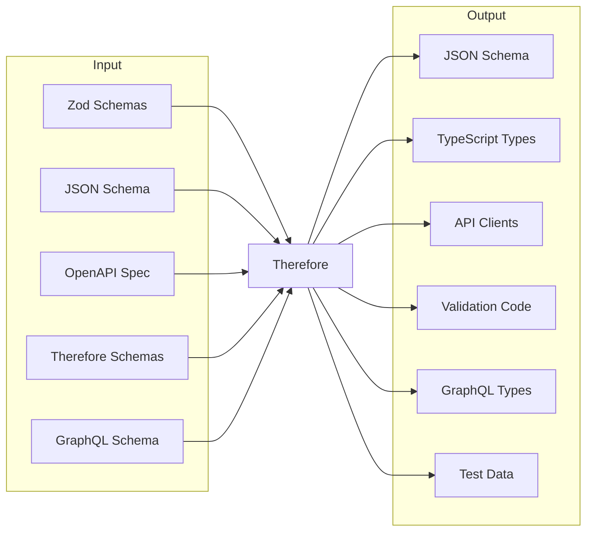

# [∴ Therefore](https://skyleague.github.io/therefore/)

<p align="center">
  
  
  
  <a href="#" target="_blank">
    
  </a>
</p>

<!-- panels:start -->

<!-- div:left-panel -->
Therefore is a schema-centric tool that deeply understands and works with data schemas. It enables you to:

**Schema Definition & Conversion**
- Define schemas in multiple formats (Zod, Therefore Schema Language, JSON Schema)
- Convert between different schema formats while preserving semantics

**Code & Data Generation**
- Generate code (TypeScript, JSON Schema, API clients)
- Create test data through schema-based arbitraries

**Schema Composition**
- Compose and transform schemas
- Reference and reuse schema components

<!-- div:right-panel -->



<!-- panels:end -->

## Core Concepts

<!-- panels:start -->

<!-- div:left-panel -->
### Schema Understanding

Therefore deeply understands schemas and their relationships:

**Type System**
- Type hierarchies and relationships
- Cross-format compatibility

**Validation & Composition**
- Validation rules and constraints
- Schema composition patterns

<!-- div:right-panel -->
### Schema Operations

Therefore can perform various operations on schemas:

**Format Handling**
- Convert between Zod, JSON Schema, OpenAPI, and GraphQL
- Preserve validation rules and type information
- Handle complex type relationships

**Schema Management**
- Reference and combine schemas
- Handle circular dependencies
- Support modular schema design

**Output Generation**
- Generate TypeScript types and validation
- Create API clients from OpenAPI specs
- Build GraphQL schemas and resolvers

**Testing Support**
- Create arbitrary test data from schemas
- Support property-based testing
- Generate realistic mock data

<!-- panels:end -->

## Why Use Therefore?

<!-- panels:start -->

<!-- div:title-panel -->
### The Problem

<!-- div:left-panel -->
When building modern applications, you often need to:

**Schema Management**
- Work with multiple schema formats
- Convert between different formats
- Maintain schema semantics

**Development Needs**
- Generate consistent types
- Create validation code
- Build test data

Traditional approaches require manually maintaining multiple schema definitions or writing complex conversion code by hand.

<!-- div:right-panel -->
### The Solution

**1. Schema Format Support**
- Define schemas in your preferred format (Zod recommended)
- Import existing JSON Schema and OpenAPI specs
- Convert between formats while preserving semantics
- Keep all your schemas in sync

**2. Schema Operations**
- Convert between different schema formats
- Generate test data from your schemas
- Compose and transform schemas
- Reference and reuse schema components

**3. Code Generation**
- Generate TypeScript types from any supported format
- Create API clients from OpenAPI specs
- Build GraphQL schemas and resolvers
- Zero runtime overhead

<!-- panels:end -->

### When to Use

Use Therefore when you:
- Work with multiple schema formats (OpenAPI, JSON Schema)
- Want to generate type-safe API clients
- Need to convert between different schema formats
- Want consistent types and validation in TypeScript

Don't use Therefore if you:
- Only need simple TypeScript types
- Don't need schema conversion or code generation
- Don't work with multiple schema formats

## Getting Started with Therefore

<!-- panels:start -->

<!-- div:left-panel -->
### Choose Your Path

Therefore offers multiple ways to work with schemas. Here's how to choose the right approach:

**1. Using Zod (Recommended)**
```typescript
// Define your schema with Zod
const user = z.object({
    name: z.string(),
    age: z.number()
})

// Therefore will generate types and more
```
Best for:
- New TypeScript projects
- Projects already using Zod
- When you need runtime validation

**2. Using OpenAPI**
```typescript
// Define your OpenAPI spec
const api = $restclient({
    openapi: '3.1.0',
    info: {
        title: 'User API',
        version: '1.0.0'
    },
    paths: {
        '/users': {
            get: {
                responses: {
                    '200': {
                        content: {
                            'application/json': {
                                schema: { type: 'array', items: { $ref: '#/components/schemas/User' } }
                            }
                        }
                    }
                }
            }
        }
    }
}, {
    validator: 'zod'
})

// Therefore will generate a type-safe client
```
Best for:
- Working with REST APIs
- When you have existing OpenAPI specs
- Building API clients

**3. Using JSON Schema**
```typescript
// Import existing JSON Schema
const schema = $jsonschema({
    type: 'object',
    properties: {
        name: { type: 'string' },
        age: { type: 'number' }
    },
    required: ['name']
})

// Therefore will generate TypeScript types
```
Best for:
- Projects with existing JSON Schema
- Cross-language schema sharing
- Legacy system integration

<!-- div:right-panel -->

### Quick Decision Guide

Choose based on your primary need:

**TypeScript Development**
↳ Use Zod approach
- Full TypeScript support
- Runtime validation
- Best developer experience

**API Integration**
↳ Use OpenAPI approach
- Type-safe API clients
- Request/response validation
- API documentation

**Schema Conversion**
↳ Use JSON Schema approach
- Cross-language compatibility
- Legacy system support
- Schema standardization

**Not Sure?**
Start with the Zod approach - it's the most flexible and can be converted to other formats later if needed.

<!-- panels:end -->

### Installation

```terminal
# Using npm
npm install @skyleague/therefore --save-dev

# Using yarn
yarn add -D @skyleague/therefore

# Using pnpm
pnpm add -D @skyleague/therefore
```

Therefore is a development tool with zero runtime dependencies - it generates code at build time.

### Quick Start

<!-- panels:start -->

<!-- div:title-panel -->

#### Define Your Schema

<!-- div:left-panel -->

Therefore looks for schema definitions in `.schema.ts` files. You can:
- Define data structures with Zod
- Import existing JSON Schema files
- Use OpenAPI specifications
- Reference other schemas

Therefore will use these definitions to generate all the code you need.

<!-- div:right-panel -->

<!-- tabs:start -->

#### **Schema Definition**

**src/schemas/user.schema.ts**

[examples/docs/01-basic-zod.schema.ts](examples/docs/01-basic-zod.schema.ts ':include :type=code')

#### **Generated Types**

**src/schemas/user.type.ts**

[examples/docs/01-basic-zod.type.ts](examples/docs/01-basic-zod.type.ts ':include :type=code')

<!-- tabs:end -->

<!-- panels:end -->

<!-- panels:start -->

<!-- div:title-panel -->

#### Generate Code

<!-- div:left-panel -->

Run Therefore to process your schemas. It will:
- Find all `.schema.ts` files
- Generate TypeScript types and validation
- Create JSON Schema files
- Build API clients if using OpenAPI
- Set up type guards and helpers

All generated code is type-safe and has zero runtime dependencies.

<!-- div:right-panel -->

```terminal
npx therefore -f src
```

<!-- panels:end -->

<!-- panels:start -->

<!-- div:title-panel -->

#### Use Generated Code

<!-- div:left-panel -->

Therefore creates everything you need to work with your data:
- Validate data at runtime with Zod
- Use generated TypeScript types
- Share JSON Schema with other services
- Make type-safe API calls

The generated code is ready to use with no additional setup needed.

<!-- div:right-panel -->

```typescript
import { User } from './user.type'
import { user } from './user.schema'

// Runtime validation
const data: unknown = JSON.parse(userInput)
if (user.safeParse(data).success) {
    // data is typed as User
    console.log(`Valid user: ${data.name}`)
}

// Type guard usage
if (User.is(data)) {
    // data is typed as User here
    console.log(data.name)
}
```

<!-- panels:end -->

## Schema Definition

Therefore provides a rich set of primitives for defining schemas that can be used for both code generation and schema conversion.

### Primitive Types

#### String Type

```typescript
// Create a string schema
$string()

// Length validation
$string().min(length: number)         // Minimum string length
$string().max(length: number)         // Maximum string length
$string().length(length: number)      // Exact string length
$string().regex(pattern: RegExp|string) // Match regular expression

// Format validation
$string().email()      // Email address (e.g. "user@example.com")
$string().uri()        // URI/URL (e.g. "https://example.com")
$string().uuid()       // UUID v4 (e.g. "123e4567-e89b-12d3-a456-426614174000")
$string().datetime()   // ISO datetime (e.g. "2024-03-20T15:30:00Z")
$string().date()       // ISO date (e.g. "2024-03-20")
$string().time()       // ISO time (e.g. "15:30:00")
$string().duration()   // ISO duration (e.g. "P1DT2H")
$string().ulid()       // ULID (e.g. "01ARZ3NDEKTSV4RRFFQ69G5FAV")
$string().base64()     // Base64 (e.g. "aGVsbG8=")
$string().hostname()   // Hostname (e.g. "example.com")
$string().ipv4()       // IPv4 (e.g. "192.168.1.1")
$string().ipv6()       // IPv6 (e.g. "2001:db8::1")
```

#### Number Type

```typescript
// Create a number schema
$number()

// Range validation
$number().min(value: number)         // Minimum value (inclusive)
$number().max(value: number)         // Maximum value (inclusive)
$number().exclusiveMin(value: number) // Minimum value (exclusive)
$number().exclusiveMax(value: number) // Maximum value (exclusive)

// Type validation
$number().integer()                  // Must be an integer
$number().multipleOf(base: number)   // Must be multiple of base (e.g. 0.01 for cents)
```

#### Integer Type

```typescript
// Create an integer schema
$integer()

// Range validation
$integer().min(value: number)         // Minimum value (inclusive)
$integer().max(value: number)         // Maximum value (inclusive)
$integer().exclusiveMin(value: number) // Minimum value (exclusive)
$integer().exclusiveMax(value: number) // Maximum value (exclusive)
$integer().multipleOf(base: number)   // Must be multiple of base
```

#### Boolean Type

```typescript
// Create a boolean schema
$boolean()
```

#### Null Type

```typescript
// Create a null schema
$null()  // Type that only accepts null
```

#### Const Type

```typescript
// Create a const schema
$const(42)              // Type that only accepts 42
$const('active')        // Type that only accepts 'active'
$const(true)           // Type that only accepts true
```

#### Unknown Type

```typescript
// Create an unknown schema
$unknown()  // Type that accepts any value
```

### Container Types

#### Array Type

```typescript
// Create an array schema
$array($string())                    // Array of strings
$array($number())                    // Array of numbers
$array($object({...}))              // Array of objects

// Length validation
$array().min(length: number)        // Minimum array length
$array().max(length: number)        // Maximum array length
$array().length(length: number)     // Exact array length
$array().unique()                   // All items must be unique
```

#### Tuple Type

```typescript
// Create a tuple schema
$tuple([$string(), $number()])      // [string, number]
$tuple([$boolean(), $string(), $number()]) // [boolean, string, number]
```

#### Object Type

```typescript
// Create an object schema
$object({
    prop1: $string(),
    prop2: $number(),
    nested: $object({...})
})

// Schema modification
$object().strict()                    // Disallow additional properties
$object().extend({ newProp: $string() })  // Add new properties
$object().merge(otherObject)          // Merge with another object schema
$object().keyof()                     // Get enum of property names

// Property selection
$object().pick('prop1', 'prop2')      // Keep only specified properties
$object().omit('prop1', 'prop2')      // Remove specified properties
$object().partial()                   // Make all properties optional
$object().partial('prop1', 'prop2')   // Make specific properties optional
$object().required()                  // Make all properties required
$object().required('prop1', 'prop2')  // Make specific properties required
```

#### Record Type

```typescript
// Create a record schema
$record($string())                   // Record with string values
$record($number())                   // Record with number values
$record($object({...}))             // Record with object values
```

### Type Combinators

#### Enum Type

```typescript
// Create an enum from array of strings
$enum(['draft', 'published'])          // String literal union
$enum(['low', 'medium', 'high'])      // Priority levels

// Create an enum from record (string values only)
$enum({
    DRAFT: 'draft',
    PUBLISHED: 'published',
    ARCHIVED: 'archived'
})
```

#### Union Type

```typescript
// Create a union schema
$union([schema1, schema2])           // Union of two schemas
$union([schema1, schema2, schema3])  // Union of multiple schemas

// Example: Common use cases
const stringOrNumber = $union([
    $string(),
    $number()
])

const status = $union([
    $string().literal('loading'),
    $object({
        state: $string().literal('error'),
        message: $string()
    }),
    $object({
        state: $string().literal('success'),
        data: $array($string())
    })
])
```

#### Intersection Type

```typescript
// Create an intersection schema
$intersection([schema1, schema2])     // Must satisfy both schemas
$intersection([schema1, schema2, schema3])  // Must satisfy all schemas

// Example: Common use cases
const withTimestamps = $intersection([
    $object({
        id: $string().uuid(),
        name: $string()
    }),
    $object({
        createdAt: $string().datetime(),
        updatedAt: $string().datetime()
    })
])
```

### Type Modifiers

```typescript
// Optional
schema.optional()      // Makes schema optional (type | undefined)
$string().optional()   // string | undefined
$number().optional()   // number | undefined

// Nullable
schema.nullable()      // Makes schema nullable (type | null)
$string().nullable()   // string | null
$number().nullable()   // number | null

// Default values
schema.default(value)  // Provides default value if undefined
$string().default('') // string (defaults to '')
$number().default(0)  // number (defaults to 0)

// Array conversion
schema.array()        // Converts to array of schema
$string().array()     // string[]
$number().array()     // number[]

// Combinations
$string()
  .nullable()
  .optional()         // string | null | undefined

$number()
  .array()
  .optional()         // number[] | undefined
```

### References

```typescript
// Reference another schema
$ref(schema)                // Reference to schema in same file
$moduleRef('./user', 'User') // Reference to schema in another file

// Example: Schema references
const address = $object({
    street: $string(),
    city: $string()
})

const user = $object({
    name: $string(),
    address: $ref(address),
    team: $moduleRef('./team', 'Team')
})
```

## Validation

Therefore provides powerful runtime validation capabilities through the `.validator()` method. This allows you to generate type-safe validation code with zero runtime overhead.

### Validation Strategies

Therefore supports two validation strategies:

**1. Ajv (Default)**
- High-performance JSON Schema validation
- Pre-compiled validation code
- Optimized for runtime performance
- Best for server-side validation with complex schemas

**2. Zod**
- Rich TypeScript-first validation
- Better developer experience
- More flexible validation rules
- Best for client-side validation

### Using Validators

```typescript
// Basic validation
const user = $object({
    name: $string,
    age: $number,
}).validator()

// With options
const user = $object({
    name: $string,
    age: $number,
}).validator({
    type: 'ajv',           // 'ajv' | 'zod'
    compile: true,         // Pre-compile validation code
    formats: true,         // Enable format validation
    parse: true,           // Generate parse functions
})
```

### Generated Validation API

When using Ajv validation, Therefore generates a validator object with the following interface:

```typescript
interface ValidatorType<T> {
    // Validate data against the schema
    validate: ValidateFunction<T>
    
    // Access the underlying JSON Schema (getter)
    get schema(): JsonSchema
    
    // Access validation errors from last validation (getter)
    get errors(): DefinedError[] | undefined
    
    // Type guard for TypeScript type narrowing
    is(o: unknown): o is T
    
    // Optional: Parse with Either-style error handling (if parse: true)
    parse?(o: unknown): { right: T } | { left: DefinedError[] }
}
```

!> When using Zod validation, Therefore only generates TypeScript types by default. You'll use Zod's native validation methods directly on the schema.

### Validation Options

#### Ajv Options (Default)
```typescript
{
    type: 'ajv',
    compile?: boolean,      // Pre-compile validation code (default: true)
    formats?: boolean,      // Enable format validation (default: true)
    parse?: boolean,        // Generate parse functions (default: true)
    coerce?: boolean,       // Enable type coercion (default: false)
    ajv?: AjvOptions,      // Custom Ajv options
    output?: {
        jsonschema?: string // Custom JSON Schema output path
    }
}
```

#### Zod Options
```typescript
{
    type: 'zod',
    types?: boolean,       // Generate TypeScript types (default: true)
    output?: {
        jsonschema?: string // Custom JSON Schema output path
    }
}
```

### Best Practices

1. **Choose the Right Validator**
   - Use Ajv for high-performance server-side validation
   - Use Zod for client-side validation and better DX

2. **Pre-compilation**
   - Enable `compile: true` for Ajv in production
   - This generates standalone validation code
   - Results in better runtime performance

3. **Error Handling**
   - Always check validation results
   - Use `parse()` for better error handling
   - Use type guards for runtime safety

4. **Type Safety**
   - Use the generated type guards
   - TypeScript will narrow types automatically
   - Validation ensures runtime type safety

### Example: Complete Validation Flow

```typescript
// Define schema with validation
export const user = $object({
    id: $string().uuid(),
    email: $string().email(),
    age: $number().min(0),
}).validator()

// Using Ajv validation
function processUserAjv(data: unknown) {
    // Type guard usage
    if (user.is(data)) {
        // data is typed as User here
        console.log(data.email)
        return
    }
    
    // Error handling
    console.error('Invalid user:', user.errors)
}

// Using Zod validation
function processUserZod(data: unknown) {
    const result = user.safeParse(data)
    if (result.success) {
        // data is typed as User here
        console.log(result.data.email)
        return
    }
    
    // Error handling with detailed issues
    console.error('Invalid user:', result.error.issues)
}
```

## Code Generation

Therefore can generate various types of code from your schemas:

1. **TypeScript Types**: Generate TypeScript interfaces and types
2. **JSON Schema**: Generate JSON Schema definitions
3. **API Clients**: Generate type-safe API clients from OpenAPI specs
4. **GraphQL Types**: Generate GraphQL type definitions

Example:
```bash
npx therefore -f src
```

This will generate:
- TypeScript types in `src/**/*.type.ts`
- JSON Schema files in `schemas/`
- API clients in `src/**/*.client.ts`

## Schema Conversion

<!-- panels:start -->

<!-- div:title-panel -->
### Converting Between Schema Formats

<!-- div:left-panel -->

Therefore enables seamless conversion between different schema formats while preserving all schema features:

**Supported Conversions**
- Zod ↔ JSON Schema
- OpenAPI ↔ TypeScript
- Therefore ↔ Zod

**Preserved Features**
- Validation rules
- Type information
- Documentation
- Custom formats
- Default values
- Optional fields

<!-- div:right-panel -->

<!-- tabs:start -->

#### **Zod to JSON Schema**

**examples/docs/05-zod-to-jsonschema.schema.ts**

[examples/docs/05-zod-to-jsonschema.schema.ts](examples/docs/05-zod-to-jsonschema.schema.ts ':include :type=code')

#### **Generated JSON Schema**

**examples/docs/schemas/product.schema.json**

[examples/docs/schemas/product.schema.json](examples/docs/schemas/product.schema.json ':include :type=code')

<!-- tabs:end -->

<!-- panels:end -->

## Test Data Generation

<!-- panels:start -->

<!-- div:title-panel -->
### Generating Test Data from Schemas

<!-- div:left-panel -->

Convert schemas into arbitraries for testing:

```typescript
import { arbitrary } from '@skyleague/therefore'

// Convert a schema into an arbitrary
const userArbitrary = arbitrary(user)

// Generate test data
const testUser = userArbitrary.sample()
```

<!-- div:right-panel -->

**Use Cases**
- Property-based testing
- Mock data generation
- API testing
- Load testing
- Edge case validation

<!-- panels:end -->

## OpenAPI Client Generation

<!-- panels:start -->

<!-- div:title-panel -->

Generate fully type-safe API clients from OpenAPI/Swagger specifications with built-in validation and error handling.

<!-- div:left-panel -->

### Basic Usage

```typescript
import { $restclient } from '@skyleague/therefore'
import type { OpenapiV3 } from '@skyleague/therefore'

const apiSpec: OpenapiV3 = {
    openapi: '3.1.1',
    info: {
        title: 'Todo API',
        version: '1.0.0',
    },
    ...rest
}

export const client = $restclient(apiSpec, {
    validator: 'zod',
    client: 'got',
})
```

### Configuration

The `$restclient` primitive accepts these options:

#### Validation
- `validator?: 'zod' | 'ajv'` - Choose validation library (default: 'ajv')
- `strict?: boolean` - Enable strict validation (default: false)
- `formats?: boolean` - Validate string formats (default: true)
- `compile?: boolean` - Pre-compile validators for better performance

#### Client Behavior  
- `client?: 'got' | 'ky'` - HTTP client library (default: 'got')
  - `got`: Node.js focused client
  - `ky`: Browser focused client, uses fetch internally
- `useEither?: boolean` - Return Either type for responses (default: true)
- `explicitContentNegotiation?: boolean` - Always include content-type (default: false)

#### Schema Handling
- `optionalNullable?: boolean` - Toggles whether optional fields will be allowed to be null. Some Rest APIs implicitly return null on optional fields. (default: false)
- `allowIntersectionTypes?: boolean` - Support intersection types (default: false)
- `preferOperationId?: boolean` - Use operationId for method names (default: true)

#### Advanced
- `transformOpenapi?: (spec: OpenapiV3) => OpenapiV3` - Transform spec before processing
- `filename?: string` - Custom output filename

### Features

The generated client provides:

- **Type Safety**
  - Full TypeScript types for requests/responses
  - Automatic path parameter handling
  - Type-safe error handling

- **Validation**
  - Runtime request/response validation
  - Support for Zod or Ajv validators
  - Pre-compiled validators for performance

- **Authentication**
  - Built-in auth scheme support
  - Automatic header injection
  - Multiple auth methods per endpoint

- **Developer Experience**
  - Automatic content negotiation
  - Error handling with type refinements
  - Promise-based API

<!-- div:right-panel -->

<!-- tabs:start -->

#### **Client Config**

**src/api/todo.schema.ts**

[examples/docs/02-openapi-client.schema.ts](examples/docs/02-openapi-client.schema.ts ':include :type=code')

#### **OpenAPI Spec**

**src/api/todo-api.yaml**

[examples/docs/todo-api.yaml](examples/docs/todo-api.yaml ':include :type=code')

#### **Generated Client**

**src/api/todo.client.ts**

[examples/docs/02-openapi-client.client.ts](examples/docs/02-openapi-client.client.ts ':include :type=code')

#### **Generated Types**

**src/api/todo.zod.ts**

[examples/docs/02-openapi-client.zod.ts](examples/docs/02-openapi-client.zod.ts ':include :type=code')

<!-- tabs:end -->

<!-- panels:end -->


## GraphQL Support

<!-- panels:start -->

<!-- div:title-panel -->
!> GraphQL support is currently in an experimental phase. The API and functionality may undergo significant changes in future releases. While usable, we recommend carefully evaluating it for production use. We welcome feedback and contributions to help stabilize this feature.


<!-- div:left-panel -->

Generate type-safe GraphQL schemas using Therefore's schema language:
- Define schemas with type safety
- Automatic resolver type generation
- Circular references support
- Schema composition and reuse

<!-- div:right-panel -->

<!-- tabs:start -->

#### **Schema Definition**

**src/schema/user.schema.ts**

[examples/docs/04-graphql.schema.ts](examples/docs/04-graphql.schema.ts ':include :type=code')

#### **Generated Types**

**src/schema/user.type.ts**

[examples/docs/04-graphql.type.ts](examples/docs/04-graphql.type.ts ':include :type=code')

#### **Generated GraphQL Schema**

**src/schema/user.graphql**

[examples/docs/04-graphql.graphql](examples/docs/04-graphql.graphql ':include :type=code')

<!-- tabs:end -->

<!-- panels:end -->

## Development Guide

### CLI Options

```bash
npx therefore [options]

Options:
  -f, --files           Globs to scan for schemas (required)
  -i, --ignore-pattern  Globs to exclude [default: ["**/*.d.ts","node_modules"]]
  --clean              Clean output directory before generation [default: true]
  --migrate-to         Migrate schemas to specified validator [choices: "zod"]
```

### Security

The security considerations depend on your chosen validation strategy:

**When Using Ajv (Default)**
- Security considerations are a superset of [`Ajv`](https://github.com/ajv-validator/ajv#security-considerations)
- Therefore implements strict validation by default
- No additional properties allowed unless explicitly enabled
- All properties required unless marked optional

**When Using Zod**
- Security considerations are inherited from [Zod](https://github.com/colinhacks/zod)
- Runtime type checking is performed by Zod's validation engine
- Strict type checking enabled by default
- Custom validation rules are executed in order defined

In both cases, Therefore itself does not perform validation - it generates the validation code that uses either Ajv or Zod. The security of your validation depends on:
1. The validation strategy you choose
2. The validation options you configure
3. How you handle validation errors in your code

### Advanced Examples

<!-- panels:start -->

<!-- div:title-panel -->
#### Circular References

<!-- div:left-panel -->

Therefore supports complex data types with circular references. A common example is the JSON data type, which can contain nested objects and arrays that reference themselves:

```typescript
// Define a JSON type that can contain nested JSON values
export const json = $validator(
    $union([
        $string, 
        $null, 
        $boolean, 
        $number, 
        $record($ref(() => json)), 
        $array($ref(() => json))
    ])
)
```

<!-- div:right-panel -->

The generated TypeScript types handle circular references correctly:

```typescript
export type Json =
    | string
    | null
    | boolean
    | number
    | { [k: string]: Json | undefined }
    | Json[]
```

<!-- panels:end -->

## Enterprise Support

SkyLeague provides Enterprise Support for Therefore. Visit [skyleague.io](https://skyleague.io) for:
- Custom integrations
- Implementation support
- Training and consulting
- Priority issue resolution

## License

Copyright (c) 2025, SkyLeague Technologies B.V.. 'SkyLeague' and the astronaut logo are trademarks of SkyLeague Technologies, registered at Chamber of Commerce in The Netherlands under number 86650564.

Permission is hereby granted, free of charge, to any person obtaining a copy of this software and associated documentation files (the "Software"), to deal in the Software without restriction, including without limitation the rights to use, copy, modify, merge, publish, distribute, sublicense, and/or sell copies of the Software, and to permit persons to whom the Software is furnished to do so, subject to the following conditions:

The above copyright notice and this permission notice shall be included in all copies or substantial portions of the Software.

THE SOFTWARE IS PROVIDED "AS IS", WITHOUT WARRANTY OF ANY KIND, EXPRESS OR IMPLIED, INCLUDING BUT NOT LIMITED TO THE WARRANTIES OF MERCHANTABILITY, FITNESS FOR A PARTICULAR PURPOSE AND NONINFRINGEMENT. IN NO EVENT SHALL THE AUTHORS OR COPYRIGHT HOLDERS BE LIABLE FOR ANY CLAIM, DAMAGES OR OTHER LIABILITY, WHETHER IN AN ACTION OF CONTRACT, TORT OR OTHERWISE, ARISING FROM, OUT OF OR IN CONNECTION WITH THE SOFTWARE OR THE USE OR OTHER DEALINGS IN THE SOFTWARE.
